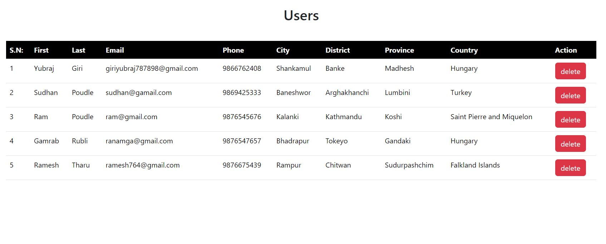

# React CURD

## TO Run Project

### Step 1: Run the react app 
```bash
npm run dev
```
### Step 2: Go to auth folder
```bash
cd auth
```
### Step 3: Start the db json database on port 800
```bash
npx json-server --watch db.json --port 8000
```
### Step 4: Enter multiple entries and save

### Step 5: View enter user data using the view data button

##SCREENSHOT

